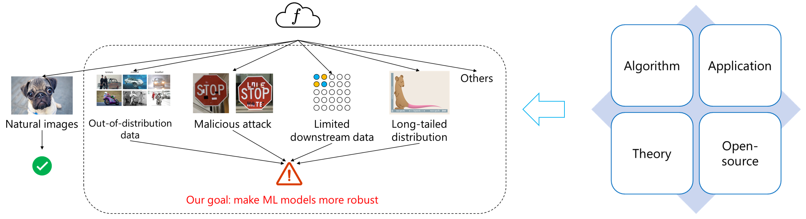

The long-term research goal is to build robust models for modern AI, such as pre-trained models and large models. We create new theory, algorithms, applications, and open-sourced library to achieve our goal.

Our research consists of the following topics with selected publications: [[View by year](https://jd92.wang/publications/)]

##### Out-of-distribution (Domain) generalization and adaptation for distribution shift

- **[ICLR'23]** [Out-of-distribution Representation Learning for Time Series Classification](https://arxiv.org/abs/2209.07027). Wang Lu, Jindong Wang, Xinwei Sun, Yiqiang Chen, and Xing Xie. 
- **[TKDE'22]** [Generalizing to Unseen Domains: A Survey on Domain Generalization](https://arxiv.org/abs/2103.03097). Jindong Wang, Cuiling Lan, Chang Liu, Yidong Ouyang, Tao Qin, Wang Lu, Yiqiang Chen, Wenjun Zeng, and Philip S. Yu.
- **[TMLR'22]** [Domain-invariant Feature Exploration for Domain Generalization](https://arxiv.org/abs/2207.12020). Wang Lu, Jindong Wang, Haoliang Li, Yiqiang Chen, and Xing Xie.
- **[UbiComp'22]** [Semantic-Discriminative Mixup for Generalizable Sensor-based Cross-domain Activity Recognition](http://arxiv.org/abs/2206.06629). Wang Lu, Jindong Wang, Yiqiang Chen, Sinno Pan, Chunyu Hu, and Xin Qin.
- **[NeurIPS'21]** [Learning causal semantic representation for out-of-distribution prediction](https://arxiv.org/abs/2011.01681). Chang Liu, Xinwei Sun, Jindong Wang , Haoyue Tang, Tao Li, Tao Qin, Wei Chen, and Tie-Yan Liu.
- **[CIKM'21]** [Adarnn: Adaptive learning and forecasting of time series](https://arxiv.org/abs/2108.04443). Yuntao Du, Jindong Wang, Wenjie Feng, Sinno Pan, Tao Qin, Renjun Xu, and Chongjun Wang.
- **[TNNLS'20, 300 + citations]** [Deep subdomain adaptation network for image classification](https://ieeexplore.ieee.org/document/9085896). Yongchun Zhu, Fuzhen Zhuang, Jindong Wang, Guolin Ke, Jingwu Chen, Jiang Bian, Hui Xiong, and Qing He.
- **[ACMMM'18, 400+ citations]** [Visual domain adaptation with manifold embedded distribution alignment](https://jd92.wang/assets/files/a11_mm18.pdf). Jindong Wang, Wenjie Feng, Yiqiang Chen, Han Yu, Meiyu Huang, and Philip S Yu.
- **[ICDM'17, 400+ citations]** [Balanced distribution adaptation for transfer learning](http://ieeexplore.ieee.org/document/8215613/?part=1). Jindong Wang, Yiqiang Chen, Shuji Hao, Wenjie Feng, and Zhiqi Shen.
- Open-source: 
  - [Transfer learning](https://github.com/jindongwang/transferlearning) 
  - robustlearn: A unified repo for robust machine learning, such as OOD and adversarial robustness: [robustlearn](https://github.com/microsoft/robustlearn) 

##### Semi-supervised learning for low-resource learning

- **[ICLR'23]** [FreeMatch: Self-adaptive Thresholding for Semi-supervised Learning](https://arxiv.org/abs/2205.07246). Yidong Wang, Hao Chen, Qiang Heng, Wenxin Hou, Yue Fan, Zhen Wu, Jindong Wang, Marios Savvides, Takahiro Shinozaki, Bhiksha Raj, Bernt Schiele, and Xing Xie.
- **[ICLR'23]** [SoftMatch: Addressing the Quantity-Quality Tradeoff in Semi-supervised Learning](https://arxiv.org/abs/2301.10921). Hao Chen, Ran Tao, Yue Fan, Yidong Wang, Jindong Wang, Bernt Schiele, Xing Xie, Bhiksha Raj, and Marios Savvides.
- **[NeurIPS'22]** [USB: A Unified Semi-supervised Learning Benchmark](https://arxiv.org/abs/2208.07204). Yidong Wang, Hao Chen, Yue Fan, Wang Sun, Ran Tao, Wenxin Hou, Renjie Wang, Linyi Yang, Zhi Zhou, Lan-Zhe Guo, Heli Qi, Zhen Wu, Yu-Feng Li, Satoshi Nakamura, Wei Ye, Marios Savvides, Bhiksha Raj, Takahiro Shinozaki, Bernt Schiele, Jindong Wang, Xing Xie, and Yue Zhang.
- **[TASLP'22]** [Exploiting Adapters for Cross-lingual Low-resource Speech Recognition](https://arxiv.org/abs/2105.11905). Wenxin Hou, Han Zhu, Yidong Wang, Jindong Wang, Tao Qin, Renjun Xu, and Takahiro Shinozaki.
- **[NeurIPS'21, 200+ citations]** [Flexmatch: Boosting semi-supervised learning with curriculum pseudo labeling](https://arxiv.org/abs/2110.08263). Bowen Zhang, Yidong Wang, Wenxin Hou, Hao Wu, Jindong Wang, Manabu Okumura, and Takahiro Shinozaki.
- Open-source:
  - USB: A unified semi-supervised learning toolbox for CV, NLP, and Audio: [USB](https://github.com/microsoft/Semi-supervised-learning) 
  - A unified Pytorch-based semi-supervised learning library: **[TorchSSL](https://github.com/TorchSSL/TorchSSL) 

##### Safe transfer learning for security

- **[arXiv'23]** [On the Robustness of ChatGPT: An Adversarial and Out-of-distribution Perspective](https://arxiv.org/abs/2302.12095). Jindong Wang, Xixu Hu, Wenxin Hou, Hao Chen, Runkai Zheng, Yidong Wang, Linyi Yang, Haojun Huang, Wei Ye, Xiubo Geng, Binxin Jiao, Yue Zhang, and Xing Xie.
- **[ICSE'22]** [ReMoS: Reducing Defect Inheritance in Transfer Learning via Relevant Model Slicing](https://jd92.wang/assets/files/icse22-remos.pdf). Ziqi Zhang, Yuanchun Li, Jindong Wang, Bingyan Liu, Ding Li, Xiangqun Chen, Yao Guo, and Yunxin Liu.
- **[IEEE TBD'22]** [Personalized Federated Learning with Adaptive Batchnorm for Healthcare](https://arxiv.org/abs/2112.00734). Wang Lu, Jindong Wang, Yiqiang Chen, Xin Qin, Renjun Xu, Dimitrios Dimitriadis, and Tao Qin.
- **[TKDE'22]** [Unsupervised deep anomaly detection for multi-sensor time-series signals](https://arxiv.org/abs/2107.12626). Yuxin Zhang, Yiqiang Chen, Jindong Wang, and Zhiwen Pan.
- **[IntSys'22, 400+ citations]** [Fedhealth: A federated transfer learning framework for wearable healthcare](https://ieeexplore.ieee.org/document/9076082). Yiqiang Chen, Xin Qin, Jindong Wang, Chaohui Yu, and Wen Gao. 
- Open-source:
  - PersonalizedFL: a personalized federated learning libraty: [PersonalizedFL](https://github.com/microsoft/PersonalizedFL) 
  - robustlearn: A unified repo for robust machine learning, such as OOD and adversarial robustness: [robustlearn](https://github.com/microsoft/robustlearn) 

##### Imbalanced learning for long-tailed tasks

- **[arXiv'23]** [Exploring Vision-Language Models for Imbalanced Learning](https://arxiv.org/abs/2304.01457). Yidong Wang, Zhuohao Yu, Jindong Wang, Qiang Heng, Hao Chen, Wei Ye, Rui Xie, Xing Xie, Shikun Zhang.
- **[ACML'22]** [Margin Calibration for Long-Tailed Visual Recognition](https://arxiv.org/abs/2112.07225). Yidong Wang, Bowen Zhang, Wenxin Hou, Zhen Wu, Jindong Wang, and Takahiro Shinozaki.
- Open-source:
  - Imbalance-VLM: a library for imbalanced learning in vision-language models. [[Imbalance-VLM](https://github.com/Imbalance-VLM/Imbalance-VLM)]

##### Miscellaneous

1. An easy-to-use speech recognition toolkit based on Espnet: [EasyESPNet](https://github.com/jindongwang/EasyEspnet)
2. Leading the transfer learning tutorial (迁移学习简明手册) on Github:
                    [Tutorial](https://github.com/jindongwang/transferlearning-tutorial)
3. I'm also leading other popular research projects: [Machine learning](https://github.com/jindongwang/MachineLearning), [Activity recognition](https://github.com/jindongwang/activityrecognition)
4.  I started a software studio *Pivot Studio* and made many applications in 2010-2014:  [Our applications](https://v.youku.com/v_show/id_XNjI2Njg2MzAw.html?spm=a2hbt.13141534.1_2.d_1&scm=20140719.manual.114461.video_XNjI2Njg2MzAw)
